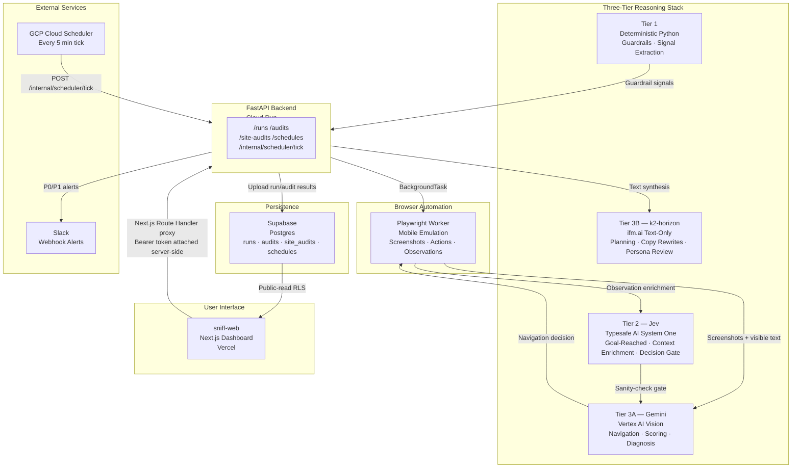
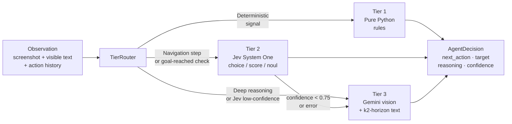
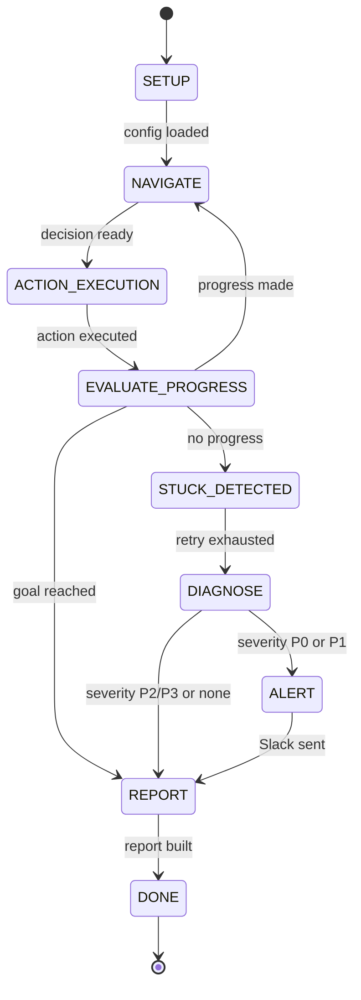
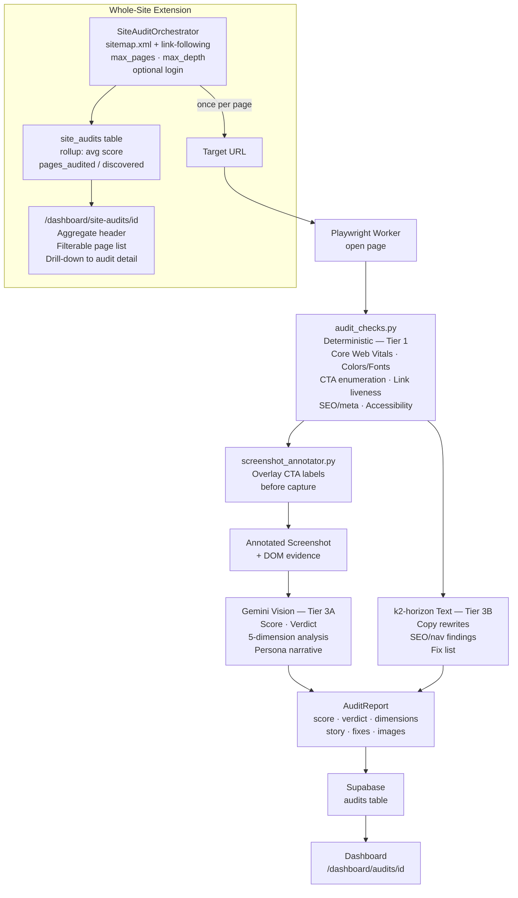
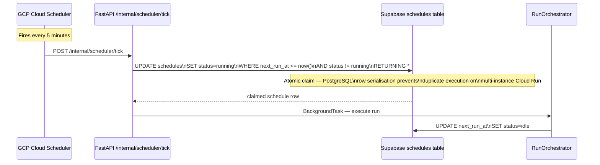
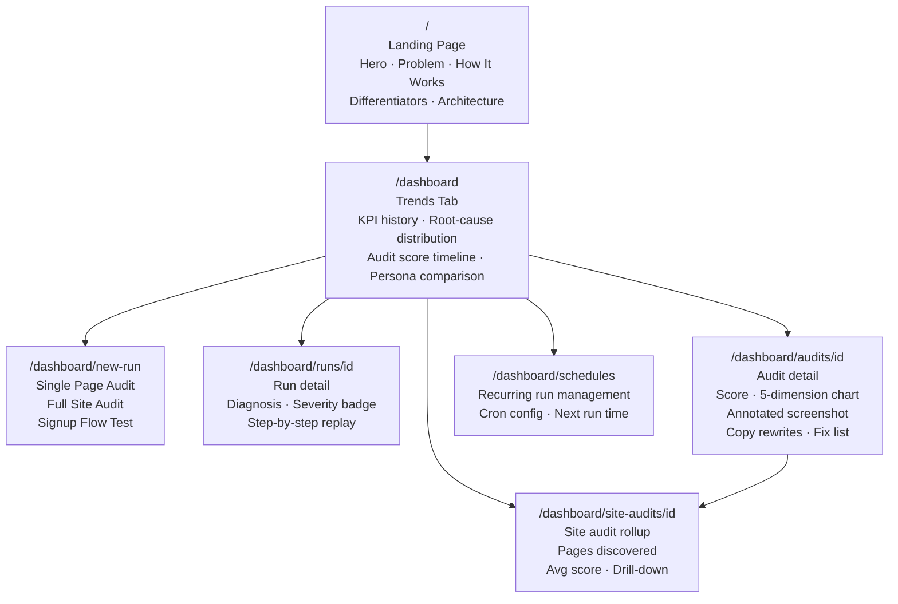
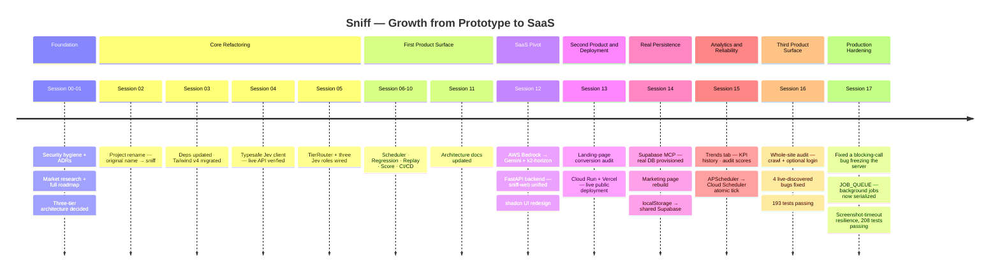

# Sniff — The AI Mystery Shopper for Your Website

> An autonomous browser agent that tests signup flows and audits landing pages the way a real, easily-confused human would — then tells you exactly why they left.

[](./sniff-ai)
[](https://cloud.google.com/run)
[](https://vercel.com)
[](./agents.md)

---

## ⚠️ IBM Bob Organisation Disclaimer

This project was built entirely using **IBM Bob 2.0** across two organisations:

| Organisation | Region | Role |
|---|---|---|
| `TECHZONE-TS022872826` | us-east | Existing organisation from a prior IBM hackathon. A significant portion of the earlier sessions (Sessions 00–12) were run under this org. |
| `ibm-coding-challenge-uat` | us-east | Current active organisation. Later sessions (Sessions 13–17) and all recent work run here. |

> **Note:** Both organisations used IBM Bob 2.0's Plan mode and Agent mode. The sessions documented in [`bob_sessions/`](./bob_sessions/) span both organisations. All architectural decisions, code, documentation, and deployment were produced by Bob sessions under one or the other org. See [`agents.md`](./agents.md) for the full record of Bob usage.

---

[See our Bob session and usage walkthrough on YouTube.](https://youtu.be/88_NznVOrkc)

## What Is Sniff?

Sniff is an autonomous AI agent that behaves like a real visitor — not a scripted test runner. Point it at a signup flow or a landing page, and it drives a real browser (Playwright) step by step, deciding what to click based on what it actually sees on screen.

**Two products, one agent:**

1. **Signup/Onboarding Testing** — Assign the agent a goal ("sign up for an account") and a persona (confused first-timer, impatient power user, careful reader). It attempts the flow, then classifies exactly why it failed: root cause, severity (P0–P3), and likely owner (Backend / UX / Performance / Integration). Critical issues are escalated via Slack.

2. **Landing-Page Conversion Audit** — Point it at any URL and it produces a full product-manager-style teardown: an overall score, a five-dimension breakdown (Message & Clarity, Audience Fit, Action Path, Trust & Credibility, Content Depth), an annotated screenshot of what it clicked, copy rewrites, broken-link checks, and a prioritised fix list. Everything a paid competitor report paywalls — shown in full.

3. **Whole-Site Audit** — Crawl an entire site (via `sitemap.xml` + same-origin link discovery), optionally logging in first, auditing every reachable page with a shared browser session and surfacing an aggregate rollup with per-page drill-down.

---

## Architecture Overview

### High-Level System



### Three-Tier Decision Pipeline



### Run Orchestrator State Machine



### Audit Pipeline (Single Page + Whole-Site)



### Scheduled Runs Architecture



### Frontend Page Hierarchy



### Project Growth Timeline



---

## Competitive Differentiation

| Capability | Sniff | ColdVisit | Momentic | Mabl | Rainforest QA |
|---|---|---|---|---|---|
| Persona-driven simulation | ✅ | ❌ | ❌ | ❌ | ❌ |
| Root-cause diagnosis | ✅ P0–P3 + owner | ❌ | ❌ | Partial | ❌ |
| Landing-page conversion audit | ✅ Full | ✅ Paywalled | ❌ | ❌ | ❌ |
| Whole-site crawl | ✅ | ❌ | ❌ | ❌ | ❌ |
| Scheduled/continuous runs | ✅ | ✅ | ❌ | ✅ | Partial |
| Slack escalation | ✅ | ❌ | ❌ | ✅ | ❌ |
| Mobile emulation | ✅ Playwright | ❌ | Partial | ✅ | ✅ |
| Vision-grounded navigation | ✅ | ❌ | ✅ | ❌ | ❌ |
| No scripted selectors needed | ✅ | ❌ | ✅ | ❌ | ❌ |

---

## Tech Stack

### Backend — `sniff-ai/`

| Layer | Technology |
|---|---|
| Language | Python 3.11+ |
| Web framework | FastAPI + uvicorn |
| Browser automation | Playwright (mobile device emulation) |
| AI — Vision navigation | Gemini via Vertex AI (Application Default Credentials) |
| AI — Text reasoning | k2-horizon via ifm.ai (OpenAI-compatible API) |
| AI — Fast decisions | Typesafe AI Jev (`/v1/systemone` endpoint) |
| Persistence | Supabase (Postgres with public-read RLS) |
| Notifications | Slack Incoming Webhook |
| CLI | Typer + Rich |
| Testing | pytest + pytest-asyncio (193 tests) |
| Linting | Ruff |
| Deployment | Cloud Run (via `gcloud run deploy --source .`) |

### Frontend — `sniff-web/`

| Layer | Technology |
|---|---|
| Framework | Next.js 16 (App Router) |
| Language | TypeScript (strict mode) |
| Styling | Tailwind CSS v4 |
| UI components | shadcn/ui (Radix primitives) |
| Charts | Recharts |
| Animation | Framer Motion |
| Database client | Supabase JS client |
| Deployment | Vercel |

---

## Repository Structure

```
sniff/
├── README.md                    ← You are here
├── agents.md                    ← IBM Bob usage record (all 17 sessions)
├── CONTRIBUTING.md              ← Setup, conventions, ADR process, security rules
├── HACKATHON_SUBMISSION.md      ← Pitch deck, demo script, submission materials
├── sniff-expansion-plan.md      ← Full roadmap (11 sub-tasks, competitive analysis)
│
├── sniff-ai/                    ← Python FastAPI backend
│   ├── src/
│   │   ├── agent/               ← Decision service, Gemini/k2-horizon/Jev clients, TierRouter
│   │   ├── api/                 ← FastAPI app (runs, audits, site-audits, schedules endpoints)
│   │   ├── cli/                 ← Typer CLI commands (init, run, personas, report, demo…)
│   │   ├── core/                ← Orchestrators, state machine, config, models
│   │   ├── diagnosis/           ← Deterministic root-cause classifier
│   │   ├── evidence/            ← Report builder, audit checks, screenshot annotator
│   │   ├── executor/            ← Playwright worker
│   │   ├── alerts/              ← Slack alert builder
│   │   └── integrations/        ← Supabase client
│   ├── docs/product/            ← ARCHITECTURE.md, MARKET_RESEARCH.md, SAAS_ROADMAP.md
│   └── tests/                   ← 193 tests (unit + integration)
│
├── sniff-web/                   ← Next.js dashboard
│   ├── app/
│   │   ├── page.tsx             ← Landing page
│   │   ├── dashboard/           ← Dashboard, runs, audits, site-audits, schedules
│   │   └── api/backend/         ← Route handlers proxying to FastAPI
│   └── components/              ← Shared UI components
│
├── docs/
│   ├── adr/                     ← Architecture Decision Records (ADR-000 to ADR-003)
│   ├── product/                 ← ARCHITECTURE.md, SAAS_ROADMAP.md, MARKET_RESEARCH.md
│   └── screenshots/             ← Product screenshots
│
└── bob_sessions/                ← IBM Bob session diary (17 sessions)
    ├── README.md                ← Session index
    ├── architecture.md          ← Architectural evolution record
    └── 00-17/                   ← Per-session: prompt.md, session-summary.md, bob-methodology.md
```

---

## Quick Start

### Prerequisites

- Python 3.11+, `uv` ([install](https://docs.astral.sh/uv/))
- Node.js 18+, Yarn
- GCP project with Vertex AI enabled + `gcloud auth application-default login`
- ifm.ai API key (`IFM_API_KEY`)
- Typesafe AI API key (`TYPESAFE_API_KEY`)
- Supabase project URL + keys

### Backend Setup

```bash
cd sniff-ai
cp .env.example .env       # fill in your keys
uv sync --extra dev
uv run playwright install chromium
uv run sniff init          # interactive setup wizard
```

### Run a Signup Flow Test

```bash
uv run sniff run \
  --goal "Sign up for an account" \
  --url "https://your-staging-site.com" \
  --persona confused_first_time_user
```

### Run a Landing-Page Audit

```bash
# Via CLI
uv run sniff audit --url "https://your-landing-page.com"

# Via API
curl -X POST https://your-backend.run.app/audits \
  -H "Authorization: Bearer $SNIFF_API_TOKEN" \
  -d '{"url":"https://your-landing-page.com"}'
```

### Frontend Setup

```bash
cd sniff-web
cp .env.local.example .env.local   # fill in Supabase + backend URL
yarn install
yarn dev
```

### Run Tests

```bash
cd sniff-ai
uv run --extra dev pytest           # 193 tests
cd ../sniff-web
yarn build && yarn lint
```

---

## Personas

| Persona | Behaviour | Use Case |
|---|---|---|
| `confused_first_time_user` | Slow, reads every label, gets confused by jargon, re-reads forms | Catch UX/copy problems a non-expert would hit |
| `impatient_user` | Skips instructions, taps fast, abandons quickly | Catch friction that causes drop-off for busy users |
| `careful_user` | Reads T&Cs, checks for trust signals, cautious about data | Catch missing trust cues and privacy UX |
| `power_user` | Keyboard shortcuts, knows patterns, skips obvious steps | Confirm the happy path works cleanly |

---

## Diagnosis Severity

| Level | Meaning | Slack Alert? |
|---|---|---|
| **P0** | Critical blocker — goal impossible | ✅ Immediate |
| **P1** | Major friction — goal very likely to fail | ✅ Immediate |
| **P2** | Moderate issue — goal reached with difficulty | ❌ Report only |
| **P3** | Minor polish issue | ❌ Report only |

Root-cause categories: `BACKEND_FAILURE`, `UX_CONTENT`, `PERFORMANCE`, `INTEGRATION_ERROR`

---

## Deployment

The stack is deployed as two services:

| Service | Platform | URL |
|---|---|---|
| `sniff-api` (FastAPI) | Google Cloud Run | `https://*.run.app` |
| `sniff-web` (Next.js) | Vercel | `https://*.vercel.app` |
| Database | Supabase | Postgres (public-read RLS Phase 1) |
| Scheduler | GCP Cloud Scheduler | `*/5 * * * *` → `/internal/scheduler/tick` |

**Phase 1 security model**: shared `SNIFF_API_TOKEN` Bearer token. The browser never sees it — Next.js Route Handlers attach it server-side before forwarding to FastAPI.

**Phase 2 roadmap** (before real public users): per-user Supabase Auth + RLS, Stripe billing, job queue, abuse prevention — see [`sniff-ai/docs/product/SAAS_ROADMAP.md`](./sniff-ai/docs/product/SAAS_ROADMAP.md).

---

## IBM Bob — How This Was Built

Sniff was built entirely through IBM Bob 2.0 sessions across **two IBM organisations**:

- **TECHZONE-TS022872826** (us-east) — prior hackathon org, used for Sessions 00–12
- **ibm-coding-challenge-uat** (us-east) — current org, used for Sessions 13–17 and ongoing

Every session is documented in [`bob_sessions/`](./bob_sessions/) with:
- The exact prompt given to Bob
- What was done, what deviated from the plan, and why
- How Bob was used (mode, tools, sub-agents, MCP servers)

Key Bob capabilities applied across the project:

| Capability | Sessions |
|---|---|
| **Plan mode** for architecture + roadmap decisions | 00, 01 |
| **Supabase MCP** for live DB provisioning + migrations | 14, 15, 16 |
| **Sub-agents** for parallel independent work | 12, 14, 15 |
| **Live API verification** before coding (Jev, Gemini, k2-horizon) | 04, 12 |
| **Web research** for competitor analysis and deployment debugging | 01, 13, 15, 16 |
| **Shell tools** for deployment, test runs, bulk operations | all Agent sessions |

See [`agents.md`](./agents.md) for the complete record and [`bob_sessions/architecture.md`](./bob_sessions/architecture.md) for every architectural decision.

---

## Key Documents

| Document | Contents |
|---|---|
| [`agents.md`](./agents.md) | IBM Bob methodology — all modes, tools, sub-agents, MCP servers |
| [`bob_sessions/architecture.md`](./bob_sessions/architecture.md) | Every architectural decision and its evolution |
| [`sniff-ai/docs/product/ARCHITECTURE.md`](./sniff-ai/docs/product/ARCHITECTURE.md) | Current full system architecture |
| [`sniff-ai/docs/product/SAAS_ROADMAP.md`](./sniff-ai/docs/product/SAAS_ROADMAP.md) | Phase 2 roadmap (auth, billing, job queue) |
| [`sniff-ai/docs/product/MARKET_RESEARCH.md`](./sniff-ai/docs/product/MARKET_RESEARCH.md) | Competitive landscape, customer segments |
| [`docs/adr/`](./docs/adr/) | Architecture Decision Records |
| [`CONTRIBUTING.md`](./CONTRIBUTING.md) | Setup, coding conventions, ADR process |
| [`sniff-expansion-plan.md`](./sniff-expansion-plan.md) | Full feature roadmap and original planning document |
| [`HACKATHON_SUBMISSION.md`](./HACKATHON_SUBMISSION.md) | Pitch deck, YC slide, demo script |

---

## Project Status

| Metric | Value |
|---|---|
| Tests | 208 / 208 passing |
| Bob sessions | 18 (13 complete, 5 planned features pending) |
| Product surfaces | 3 (signup testing · landing-page audit · whole-site audit) |
| Deployment | Live — Cloud Run + Vercel |
| Auth model | Phase 1 (shared secret) — Phase 2 planned |
| ADRs | 3 formal + full evolution log in `bob_sessions/architecture.md` |
