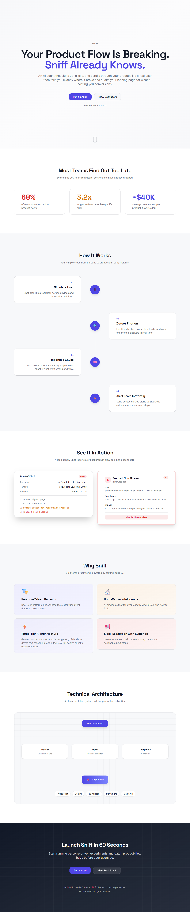
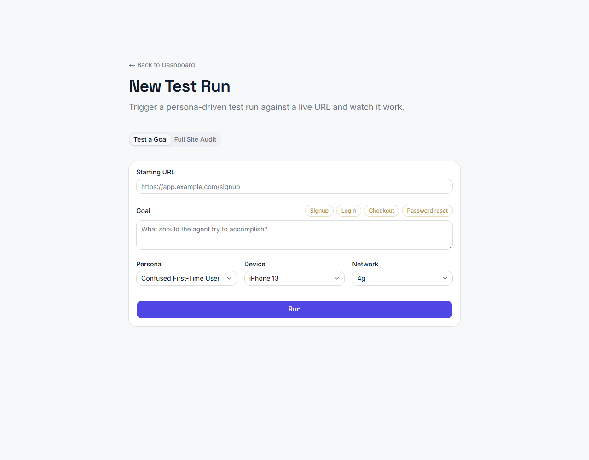
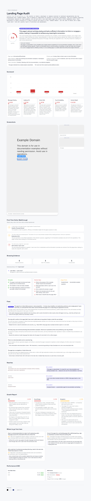
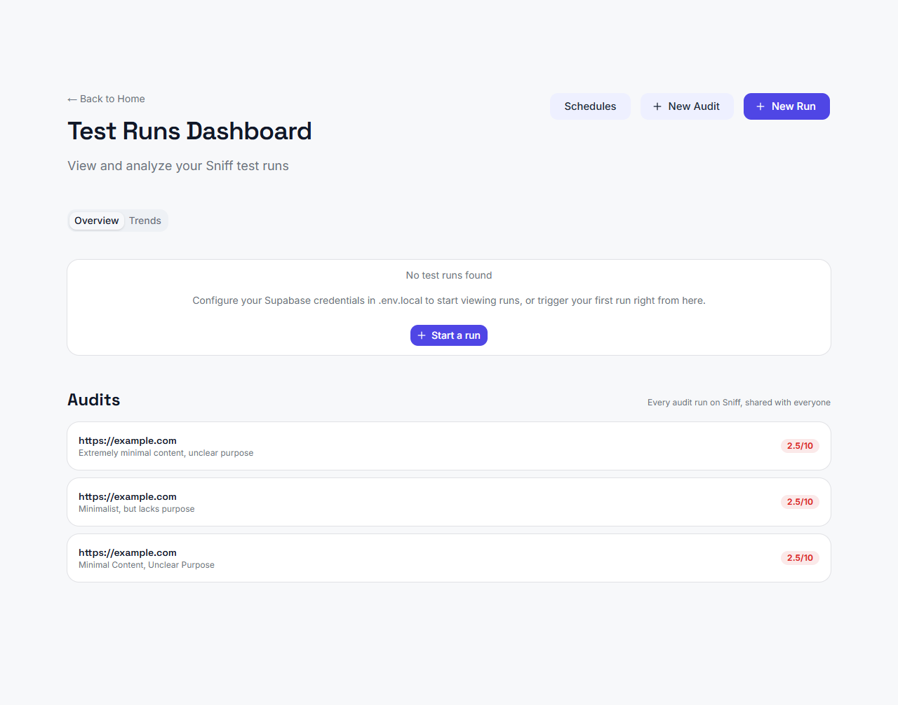
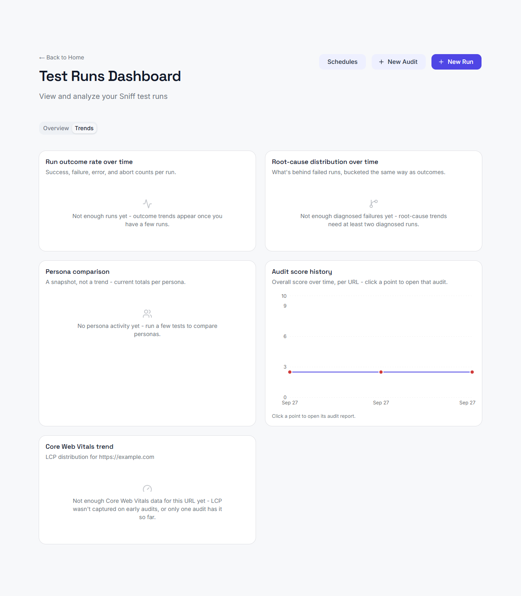
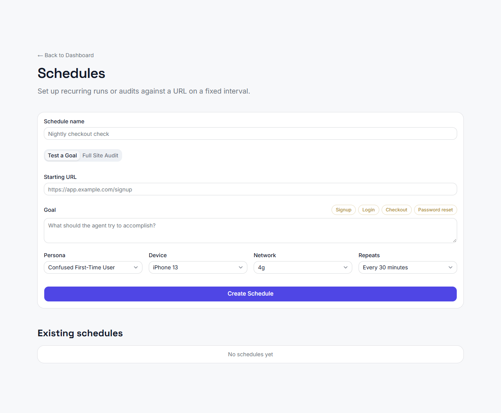


# Sniff — Product Tour (current state)

A visual, current-state reference for what Sniff actually does today, as deployed live. For the full chronological history of how it got here, see `bob_sessions/`; for architecture/requirements detail, see `docs/product/ARCHITECTURE.md`, `PRODUCT_REQUIREMENTS.md`, `SAAS_ROADMAP.md`, and `MARKET_RESEARCH.md`. Screenshots below are saved in `docs/screenshots/` and were captured directly against the live production deployment.

**Live URLs**: frontend `https://sniff-web.vercel.app`, backend `https://sniff-api-147606977567.us-central1.run.app`.

---

## What Sniff is

An autonomous AI agent that behaves like a real visitor, not a scripted test runner. It drives a real browser (Playwright) and, at every step, decides what to do next from what it actually sees on screen — the same way a person would. Two product surfaces built on the same underlying agent:

1. **Signup/onboarding flow testing** — give it a goal and a persona; it attempts the flow and, if it fails, diagnoses exactly why (root cause, severity, likely owner).
2. **Landing-page conversion audit** — point it at any URL; it produces a full product-manager-style teardown (score, 5-dimension breakdown, annotated screenshot, copy rewrites, fixes).

---

## How reasoning works: three-tier architecture

- **Tier 1 (deterministic, free)**: DOM/CSS checks — colors, fonts, Core Web Vitals, SEO/meta facts, link health. No model call.
- **Tier 2 (Jev / Typesafe AI, ultra-fast)**: goal-reached checks, context enrichment, decision sanity-gating.
- **Tier 3 (Gemini + k2-horizon)**: vision-grounded navigation decisions, scoring, narrative writing, copy rewrites. Gemini (Vertex AI) handles anything that needs to see the screenshot; k2-horizon handles text-only reasoning.

Full detail and the reasoning behind each provider choice: `docs/product/ARCHITECTURE.md` Sections 7A/7B/8.

---

## Triggering a test — web-first, not CLI-first

The web dashboard is the primary interface. A CLI (`sniff-ai/src/cli/`) still exists for developers/CI use, but the hero flow is: paste a URL, pick "Test a Goal" or "Full Site Audit," watch it run.

---

## The audit report

Every audit produces: an overall 0–10 score, a verdict and a blunter "honest verdict," a 5-dimension breakdown (Message & Clarity, Audience Fit, Action Path, Trust & Credibility, Content Depth), an annotated screenshot showing exactly what it identified and clicked as the primary CTA, a step-by-step first-time-visitor narrative, strengths/decision-gaps/jargon call-outs, a prioritized fix list with literal copy rewrites, a growth sub-report (SEO/visual design/navigation), and — as of this pass — real Core Web Vitals (LCP/FCP/CLS) and SEO facts (title, meta description, H1 count, image alt-text coverage), bucketed into good/needs-improvement/poor. Nothing here is paywalled, unlike the competitor report this schema was modeled on.

---

## Dashboard — shared, persistent, no auth gate (by design, for now)

Every run and every audit, from every visitor, is visible to everyone — there's no login yet (see "What's deliberately not built" below). Data persists in a real Supabase/Postgres project with public-read RLS policies, not in-memory state that vanishes on a backend restart.

### Trends tab

Aggregate views across runs and audits: run outcome rate over time, root-cause distribution over time, persona comparison, and — the specific gap this pass closed — audit score history per URL (with click-through from any point straight into that audit's full report) plus a Core Web Vitals distribution trend. Every section has a genuine empty state rather than a broken chart when data is sparse.

### Scheduled, recurring runs

Set a URL, goal/audit mode, and an interval; Sniff re-runs it on its own. This is what actually populates the Trends tab with real history over time instead of a handful of manual runs.

**Why this is reliable in production, not just "it works locally":** the backend autoscales to multiple Cloud Run instances. A naive in-process scheduler would fire the same job independently on every instance. Instead, schedules live in Supabase (survives restarts, shared across instances), and a single external **Cloud Scheduler** job ticks an internal endpoint every 5 minutes; the endpoint atomically claims a due schedule via a conditional SQL `UPDATE ... WHERE next_run_at <= now()` — Postgres's own row-serialization means a losing concurrent claim simply affects zero rows, not a race. This was proven against a real live schedule (created, watched through several real ticks, confirmed no duplicate firing, then deleted) before being considered done, not just unit-tested.

---

## Docs

CLI reference material and setup instructions still live here, now framed as secondary to the web dashboard rather than the primary interface. The table-of-contents sidebar collapses to a native `
` disclosure below the `lg` breakpoint instead of dumping a full sidebar above the article on mobile.

---

## What's deliberately not built (and why that's a decision, not an oversight)

- **Real per-user auth, billing, and abuse prevention** — explicitly deferred for the hackathon/public-access phase; see `docs/product/SAAS_ROADMAP.md` for what "real per-user auth via Supabase Auth + `auth.uid()`-scoped RLS" looks like when it's time to build it.
- **Native mobile app (APK/IPA) testing** — today's "mobile" testing is Playwright's device-viewport emulation of a *responsive website*, not a native app. Researched real options (managed device cloud vs. self-hosted `android-emulator-webrtc`) and the call was made to skip this for now.
- **Journey-replay UI, run-vs-run regression/baseline comparison, CI/CD GitHub Action** — real, named gaps in `docs/product/MARKET_RESEARCH.md`'s backlog table, not started yet.

---

## Deployment

- **Backend**: FastAPI + Playwright on Cloud Run (`sniff-api`), Cloud Build source deploys, `--no-cpu-throttling` (required for background-task execution to survive after the HTTP response returns), `min-instances=1`/`max-instances=3`.
- **Frontend**: Next.js on Vercel, server-only Route Handlers proxy every backend call so the shared bearer token never reaches the browser.
- **Database**: Supabase/Postgres, public-read RLS on every table (`runs`, `audits`, `schedules`, and their supporting tables).
- **Scheduling**: one Cloud Scheduler job (`sniff-scheduler-tick`), GCP-managed and independent of Cloud Run's instance count.
